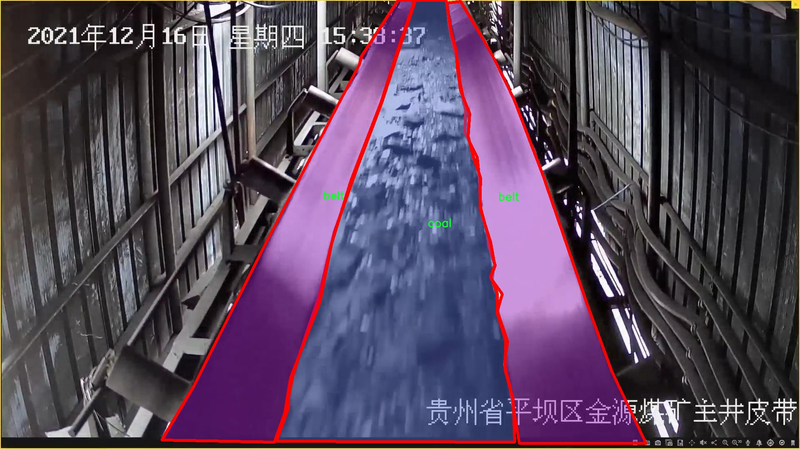

### 1.背景意义

研究背景与意义

随着工业化进程的加快，煤炭作为一种重要的能源资源，其开采和运输过程中的安全与效率问题日益受到关注。在煤矿及其运输环节，输煤皮带作为煤炭运输的主要方式，其运行状态和煤块的检测显得尤为重要。传统的人工监测方法不仅效率低下，而且容易受到人为因素的影响，导致检测结果的不准确。因此，开发一种高效、自动化的煤块检测系统显得尤为迫切。

近年来，计算机视觉技术的快速发展为煤块检测提供了新的解决方案。尤其是基于深度学习的目标检测算法，如YOLO（You Only Look Once），因其高效的实时检测能力而受到广泛关注。YOLOv11作为YOLO系列的最新版本，具备更强的特征提取能力和更快的推理速度，能够在复杂环境中实现对煤块和输煤皮带的精准识别。通过对该算法的改进，可以进一步提升其在煤块检测中的应用效果。

本研究基于改进的YOLOv11算法，构建一个煤块检测输煤皮带图像分割系统。该系统将利用包含972张图像的数据集，涵盖“belt”和“coal”两个类别，进行训练和测试。数据集经过精心标注，确保了模型训练的准确性和有效性。通过对图像的预处理和特征提取，系统能够实时监测输煤皮带上的煤块状态，及时发现异常情况，降低事故发生的风险，提高煤炭运输的安全性和效率。

综上所述，本研究不仅为煤炭行业的智能化发展提供了技术支持，也为相关领域的研究提供了新的思路和方法。通过实现煤块的自动检测与分割，能够有效提升煤炭运输的管理水平，推动煤炭行业的可持续发展。

### 2.视频效果

[2.1 视频效果](https://www.bilibili.com/video/BV1ATUGYqEQe/)

### 3.图片效果


##### [项目涉及的源码数据来源链接](https://kdocs.cn/l/cszuIiCKVNis)**

注意：本项目提供训练的数据集和训练教程,由于版本持续更新,暂不提供权重文件（best.pt）,请按照6.训练教程进行训练后实现上图演示的效果。

### 4.数据集信息

##### 4.1 本项目数据集类别数＆类别名

nc: 2
names: ['belt', 'coal']


该项目为【图像分割】数据集，请在【训练教程和Web端加载模型教程（第三步）】这一步的时候按照【图像分割】部分的教程来训练

##### 4.2 本项目数据集信息介绍

本项目数据集信息介绍

本项目所使用的数据集名为“belt_20240617”，旨在为改进YOLOv11的煤块检测输煤皮带图像分割系统提供高质量的训练数据。该数据集专注于输煤皮带上的煤块检测，具有重要的实际应用价值，能够有效提升煤矿运输过程中的自动化监测水平。数据集中包含两个主要类别，分别为“belt”和“coal”，其中“belt”代表输煤皮带的结构部分，而“coal”则指代输送过程中的煤块。这两个类别的设置使得模型在进行图像分割时能够清晰地区分输煤皮带与煤块，进而提高检测的准确性和效率。

数据集的构建过程经过精心设计，确保了样本的多样性和代表性。样本图像来源于不同的煤矿现场，涵盖了各种环境条件和光照变化，以增强模型的鲁棒性。每张图像都经过专业标注，确保每个类别的边界清晰可辨，标注的准确性为模型的训练提供了坚实的基础。此外，数据集还考虑到了不同煤块的形状、大小和颜色等特征，使得模型能够适应多种实际情况。

通过使用“belt_20240617”数据集，研究团队希望能够有效提升YOLOv11在煤块检测任务中的表现，推动煤矿行业的智能化进程。数据集的构建不仅为模型训练提供了必要的支持，也为后续的研究和应用奠定了基础。随着煤矿自动化程度的提高，精准的煤块检测系统将有助于提高生产效率，降低人工成本，确保煤矿作业的安全性和可靠性。




### 5.全套项目环境部署视频教程（零基础手把手教学）

[5.1 所需软件PyCharm和Anaconda安装教程（第一步）](https://www.bilibili.com/video/BV1BoC1YCEKi/?spm_id_from=333.999.0.0&vd_source=bc9aec86d164b67a7004b996143742dc)


[5.2 安装Python虚拟环境创建和依赖库安装视频教程（第二步）](https://www.bilibili.com/video/BV1ZoC1YCEBw?spm_id_from=333.788.videopod.sections&vd_source=bc9aec86d164b67a7004b996143742dc)

### 6.改进YOLOv11训练教程和Web_UI前端加载模型教程（零基础手把手教学）

[6.1 改进YOLOv11训练教程和Web_UI前端加载模型教程（第三步）](https://www.bilibili.com/video/BV1BoC1YCEhR?spm_id_from=333.788.videopod.sections&vd_source=bc9aec86d164b67a7004b996143742dc)


按照上面的训练视频教程链接加载项目提供的数据集，运行train.py即可开始训练



     Epoch   gpu_mem       box       obj       cls    labels  img_size
     1/200     20.8G   0.01576   0.01955  0.007536        22      1280: 100%|██████████| 849/849 [14:42<00:00,  1.04s/it]
               Class     Images     Labels          P          R     mAP@.5 mAP@.5:.95: 100%|██████████| 213/213 [01:14<00:00,  2.87it/s]
                 all       3395      17314      0.994      0.957      0.0957      0.0843

     Epoch   gpu_mem       box       obj       cls    labels  img_size
     2/200     20.8G   0.01578   0.01923  0.007006        22      1280: 100%|██████████| 849/849 [14:44<00:00,  1.04s/it]
               Class     Images     Labels          P          R     mAP@.5 mAP@.5:.95: 100%|██████████| 213/213 [01:12<00:00,  2.95it/s]
                 all       3395      17314      0.996      0.956      0.0957      0.0845

     Epoch   gpu_mem       box       obj       cls    labels  img_size
     3/200     20.8G   0.01561    0.0191  0.006895        27      1280: 100%|██████████| 849/849 [10:56<00:00,  1.29it/s]
               Class     Images     Labels          P          R     mAP@.5 mAP@.5:.95: 100%|███████   | 187/213 [00:52<00:00,  4.04it/s]
                 all       3395      17314      0.996      0.957      0.0957      0.0845


###### [项目数据集下载链接](https://kdocs.cn/l/cszuIiCKVNis)

### 7.原始YOLOv11算法讲解

YOLO11采用改进的骨干和颈部架构，增强了特征提取能力，提高了物体检测的精确度和复杂任务的表现。YOLO11引入精炼的架构设计和优化的训练流程，实现更快的处理速度，同时保持精度和性能之间的最佳平衡。通过模型设计的进步，YOLO11m在COCO数据集上实现了更高的均值平均精度（mAP），同时使用比YOLOv8m少22%的参数，使其在不妥协准确性的情况下更加计算高效。YOLO11可以无缝部署在各种环境中，包括边缘设备、云平台以及支持NVIDIA
GPU的系统，确保最大灵活性。无论是物体检测、实例分割、图像分类、姿态估计，还是定向物体检测（OBB），YOLO11都旨在应对多样的计算机视觉挑战。


##### **Ultralytics YOLO11相比于之前版本的主要改进有哪些？**

Ultralytics YOLO11在其前身基础上引入了几项重要进步。主要改进包括：

  1. **增强的特征提取** ：YOLO11采用改进的骨干和颈部架构，增强了特征提取能力，提高了物体检测的精确度。
  2.  **优化的效率和速度** ：精炼的架构设计和优化的训练流程实现了更快的处理速度，同时保持了准确性和性能之间的平衡。
  3.  **更高的准确性与更少的参数** ：YOLO11m在COCO数据集上实现了更高的均值平均精度（mAP），同时使用比YOLOv8m少22%的参数，使其在不妥协准确性的情况下更加计算高效。
  4.  **环境适应性强** ：YOLO11可以在多种环境中部署，包括边缘设备、云平台以及支持NVIDIA GPU的系统。
  5.  **支持广泛的任务** ：YOLO11支持多种计算机视觉任务，如物体检测、实例分割、图像分类、姿态估计和定向物体检测（OBB）。

我们先来看一下其网络结构有什么变化，可以看出，相比较于YOLOv8模型，其将CF2模块改成C3K2，同时在SPPF模块后面添加了一个C2PSA模块，且将YOLOv10的head思想引入到YOLO11的head中，使用深度可分离的方法，减少冗余计算，提高效率。下面我们来详细看一下这两个模块的结构是怎么构成的，以及它们为什么要这样设计


##### C3K2的网络结构

从下面图中我们可以看到，C3K2模块其实就是C2F模块转变出来的，它代码中有一个设置，就是当c3k这个参数为FALSE的时候，C3K2模块就是C2F模块，也就是说它的Bottleneck是普通的Bottleneck；反之当它为true的时候，将Bottleneck模块替换成C3模块。


##### C2PSA的网络结构

` `C2PSA是对 `C2f` 模块的扩展，它结合了PSA(Pointwise Spatial
Attention)块，用于增强特征提取和注意力机制。通过在标准 `C2f` 模块中引入 PSA
块，C2PSA实现了更强大的注意力机制，从而提高了模型对重要特征的捕捉能力。


##### **C2f 模块回顾：**

**** C2f模块是一个更快的 CSP（Cross Stage Partial）瓶颈实现，它通过两个卷积层和多个 Bottleneck
块进行特征提取。相比传统的 CSPNet，C2f 优化了瓶颈层的结构，使得计算速度更快。在 C2f中，`cv1` 是第一个 1x1
卷积，用于减少通道数；`cv2` 是另一个 1x1 卷积，用于恢复输出通道数。而 `n` 是一个包含 Bottleneck 块的数量，用于提取特征。

##### **C2PSA 模块的增强** ：

**C2PSA** 扩展了 C2f，通过引入PSA( **Position-Sensitive Attention)**
，旨在通过多头注意力机制和前馈神经网络来增强特征提取能力。它可以选择性地添加残差结构（shortcut）以优化梯度传播和网络训练效果。同时，使用FFN
可以将输入特征映射到更高维的空间，捕获输入特征的复杂非线性关系，允许模型学习更丰富的特征表示。

##### head部分

YOLO11在head部分的cls分支上使用深度可分离卷积 ，具体代码如下，cv2边界框回归分支，cv3分类分支。

    
    
     self.cv2 = nn.ModuleList(
                nn.Sequential(Conv(x, c2, 3), Conv(c2, c2, 3), nn.Conv2d(c2, 4 * self.reg_max, 1)) for x in ch
            )
            self.cv3 = nn.ModuleList(
                nn.Sequential(
                    nn.Sequential(DWConv(x, x, 3), Conv(x, c3, 1)),
                    nn.Sequential(DWConv(c3, c3, 3), Conv(c3, c3, 1)),
                    nn.Conv2d(c3, self.nc, 1),
                )
                for x in ch
            )


### 8.200+种全套改进YOLOV11创新点原理讲解

#### 8.1 200+种全套改进YOLOV11创新点原理讲解大全

由于篇幅限制，每个创新点的具体原理讲解就不全部展开，具体见下列网址中的改进模块对应项目的技术原理博客网址【Blog】（创新点均为模块化搭建，原理适配YOLOv5~YOLOv11等各种版本）

[改进模块技术原理博客【Blog】网址链接](https://gitee.com/qunmasj/good)


#### 8.2 精选部分改进YOLOV11创新点原理讲解

###### 这里节选部分改进创新点展开原理讲解(完整的改进原理见上图和[改进模块技术原理博客链接](https://gitee.com/qunmasj/good)【如果此小节的图加载失败可以通过CSDN或者Github搜索该博客的标题访问原始博客，原始博客图片显示正常】


### 感受野注意力卷积（RFAConv)
#### 标准卷积操作回顾
标准的卷积操作是构造卷积神经网络的基本构件。它利用具有共享参数的滑动窗口提取特征信息，克服了全连通层构造神经网络固有的参数多、计算开销大的问题。设 X R∈C×H×W
表示输入特征图，其中C、H、W分别表示特征图的通道数、高度、宽度。为了清楚地演示卷积核的特征提取过程，我们使用 C = 1 的例子。从每个接受域滑块中提取特征信息的卷积运算可以表示为:


这里，Fi 表示计算后每个卷积滑块得到的值，Xi 表示每个滑块内对应位置的像素值，K表示卷积核，S表示卷积核中的参数个数，N表示接收域滑块的总数。可以看出，每个滑块内相同位置的 feature共享相同的参数Ki。因此，标准的卷积运算并不能捕捉到不同位置所带来的信息差异，这最终在一定程度上限制了卷积神经网络的性能。 

#### 空间注意力回顾
目前，空间注意机制是利用学习得到的注意图来突出每个特征的重要性。与前一节类似，这里以 C=1为例。突出关键特征的空间注意机制可以简单表述为:这里，Fi 表示加权运算后得到的值。xi 和Ai 表示输入特征图和学习到的注意图在不同位置的值，N为输入特征图的高和宽的乘积，表示像素值的总数。


#### 空间注意与标准卷积运算
将注意力机制整合到卷积神经网络中，可以提高卷积神经网络的性能。通过对标准卷积运算和现有空间注意机制的研究，我们认为空间注意机制有效地克服了卷积神经网络固有的参数共享的局限性。目前卷积神经网络中最常用的核大小是 1 × 1和3 × 3。在引入空间注意机制后，提取特征的卷积操作可以是 1 × 1或3 × 3卷积操作。为了直观地展示这个过程，在 1 × 1卷积运算的前面插入了空间注意机制。通过注意图对输入特征图(Re-weight“×”)进行加权运算，最后通过 1 × 1卷积运算提取接收域的滑块特征信息。整个过程可以简单地表示如下:


 这里卷积核K仅代表一个参数值。如果取A i× ki 的值作为一种新的卷积核参数，有趣的是它解决了 1×1卷积运算提取特征时的参数共享问题。然而，关于空间注意机制的传说到此结束。当空间注意机制被插入到3×3卷积运算前面时。具体情况如下:


如上所述，如果取A的值 i × ki (4)式作为一种新的卷积核参数，完全解决了大规模卷积核的参数共享问题。然而，最重要的一点是，卷积核在提取每个接受域滑块的特征时，会共享一些特征。换句话说，每个接收域滑块内都有一个重叠。仔细分析后会发现A12= a21， a13 = a22， a15 = a24……，在这种情况下，每个滑动窗口共享空间注意力地图的权重。因此，空间注意机制没有考虑整个接受域的空间特征，不能有效地解决大规模卷积核的参数共享问题。因此，空间注意机制的有效性受到限制。 

#### 创新空间注意力和标准卷积操作
该博客提出解决了现有空间注意机制的局限性，为空间处理提供了一种创新的解决方案。受RFA的启发，一系列空间注意机制被开发出来，可以进一步提高卷积神经网络的性能。RFA可以看作是一个轻量级即插即用模块，RFA设计的卷积运算(RFAConv)可以代替标准卷积来提高卷积神经网络的性能。因此，我们预测空间注意机制与标准卷积运算的结合将继续发展，并在未来带来新的突破。
接受域空间特征:为了更好地理解接受域空间特征的概念，我们将提供相关的定义。接收域空间特征是专门为卷积核设计的，并根据核大小动态生成。如图1所示，以3×3卷积核为例。在图1中，“Spatial Feature”指的是原始的Feature map。“接受域空间特征”是空间特征变换后的特征图。

 

由不重叠的滑动窗口组成。当使用 3×3卷积内核提取特征时，接收域空间特征中的每个 3×3大小窗口代表一个接收域滑块。接受域注意卷积(RFAConv):针对接受域的空间特征，我们提出了接受域注意卷积(RFA)。该方法不仅强调了接收域滑块内不同特征的重要性，而且对接收域空间特征进行了优先排序。通过该方法，完全解决了卷积核参数共享的问题。接受域空间特征是根据卷积核的大小动态生成的，因此，RFA是卷积的固定组合，不能与卷积操作的帮助分离，卷积操作同时依赖于RFA来提高性能，因此我们提出了接受场注意卷积(RFAConv)。具有3×3大小的卷积核的RFAConv整体结构如图所示。


目前，最广泛使用的接受域特征提取方法是缓慢的。经过大量的研究，我们开发了一种快速的方法，用分组卷积来代替原来的方法。具体来说，我们利用相应大小的分组卷积来动态生成基于接受域大小的展开特征。尽管与原始的无参数方法(如PyTorch提供的nn.())相比，该方法增加了一些参数，但它的速度要快得多。注意:如前一节所述，当使用 3×3卷积内核提取特征时，接收域空间特征中的每个 3×3大小窗口表示一个接收域滑块。而利用快速分组卷积提取感受野特征后，将原始特征映射为新的特征。最近的研究表明。交互信息可以提高网络性能，如[40,41,42]所示。同样，对于RFAConv来说，通过交互接受域特征信息来学习注意图可以提高网络性能。然而，与每个接收域特征交互会导致额外的计算开销，因此为了最小化计算开销和参数的数量，我们使用AvgPool来聚合每个接收域特征的全局信息。然后，使用 1×1 组卷积操作进行信息交互。最后，我们使用softmax来强调每个特征在接受域特征中的重要性。一般情况下，RFA的计算可以表示为:


这里gi×i 表示一个大小为 i×i的分组卷积，k表示卷积核的大小，Norm表示归一化，X表示输入的特征图，F由注意图 a相乘得到 rf 与转换后的接受域空间特征 Frf。与CBAM和CA不同，RFA能够为每个接受域特征生成注意图。卷积神经网络的性能受到标准卷积操作的限制，因为卷积操作依赖于共享参数，对位置变化带来的信息差异不敏感。然而，RFAConv通过强调接收域滑块中不同特征的重要性，并对接收域空间特征进行优先级排序，可以完全解决这个问题。通过RFA得到的feature map是接受域空间特征，在“Adjust Shape”后没有重叠。因此，学习到的注意图将每个接受域滑块的特征信息聚合起来。换句话说，注意力地图不再共享在每个接受域滑块。这完全弥补了现有 CA和CBAM注意机制的不足。RFA为标准卷积内核提供了显著的好处。而在调整形状后，特征的高度和宽度是 k倍，需要进行 stride = k的k × k卷积运算来提取特征信息。RFA设计的卷积运算RFAConv为卷积带来了良好的增益，对标准卷积进行了创新。
此外，我们认为现有的空间注意机制应该优先考虑接受域空间特征，以提高网络性能。众所周知，基于自注意机制的网络模型[43,44,45]取得了很大的成功，因为它解决了卷积参数共享的问题，并对远程信息进行建模。然而，自注意机制也为模型引入了显著的计算开销和复杂性。我们认为，将现有的空间注意机制的注意力引导到接受场空间特征上，可以以类似于自我注意的方式解决长期信息的参数共享和建模问题。与自我关注相比，这种方法需要的参数和计算资源少得多。答案如下:(1)将以接收场空间特征为中心的空间注意机制与卷积相结合，消除了卷积参数共享的问题。(2)现有的空间注意机制已经考虑了远程信息，可以通过全局平均池或全局最大池的方式获取全局信息，其中明确考虑了远程信息。因此，我们设计了新的 CBAM和CA模型，称为RFCBAM和RFCA，它们专注于接受域空间特征。与RFA类似，使用最终的k × k stride = k 的卷积运算来提取特征信息。这两种新的卷积方法的具体结构如图 3所示，我们称这两种新的卷积操作为 RFCBAMConv和RFCAConv。与原来的CBAM相比，我们在RFCBAM中使用SE attention来代替CAM。因为这样可以减少计算开销。此外，在RFCBAM中，通道注意和空间注意不是分开执行的。相反，它们是同时加权的，使得每个通道获得的注意力地图是不同的。


### 9.系统功能展示

图9.1.系统支持检测结果表格显示

  图9.2.系统支持置信度和IOU阈值手动调节

  图9.3.系统支持自定义加载权重文件best.pt(需要你通过步骤5中训练获得)

  图9.4.系统支持摄像头实时识别

  图9.5.系统支持图片识别

  图9.6.系统支持视频识别

  图9.7.系统支持识别结果文件自动保存

  图9.8.系统支持Excel导出检测结果数据


### 10. YOLOv11核心改进源码讲解

#### 10.1 afpn.py

以下是代码中最核心的部分，并对其进行了详细的中文注释：

```python
import torch
import torch.nn as nn
import torch.nn.functional as F
from ..modules.conv import Conv

# 定义基本的卷积块
class BasicBlock(nn.Module):
    def __init__(self, filter_in, filter_out):
        super(BasicBlock, self).__init__()
        # 定义两个卷积层
        self.conv1 = Conv(filter_in, filter_out, 3)  # 第一个卷积层，卷积核大小为3
        self.conv2 = Conv(filter_out, filter_out, 3, act=False)  # 第二个卷积层，卷积核大小为3，不使用激活函数

    def forward(self, x):
        residual = x  # 保存输入以便后续残差连接
        out = self.conv1(x)  # 通过第一个卷积层
        out = self.conv2(out)  # 通过第二个卷积层
        out += residual  # 残差连接
        return self.conv1.act(out)  # 返回激活后的输出


# 定义上采样模块
class Upsample(nn.Module):
    def __init__(self, in_channels, out_channels, scale_factor=2):
        super(Upsample, self).__init__()
        # 定义上采样操作
        self.upsample = nn.Sequential(
            Conv(in_channels, out_channels, 1),  # 1x1卷积层
            nn.Upsample(scale_factor=scale_factor, mode='bilinear')  # 双线性插值上采样
        )

    def forward(self, x):
        return self.upsample(x)  # 前向传播


# 定义下采样模块
class Downsample_x2(nn.Module):
    def __init__(self, in_channels, out_channels):
        super(Downsample_x2, self).__init__()
        # 定义2倍下采样
        self.downsample = Conv(in_channels, out_channels, 2, 2, 0)  # 步幅为2的卷积

    def forward(self, x):
        return self.downsample(x)  # 前向传播


# 自适应特征融合模块（ASFF）
class ASFF_2(nn.Module):
    def __init__(self, inter_dim=512):
        super(ASFF_2, self).__init__()
        self.inter_dim = inter_dim
        compress_c = 8  # 压缩通道数

        # 定义权重卷积层
        self.weight_level_1 = Conv(self.inter_dim, compress_c, 1)
        self.weight_level_2 = Conv(self.inter_dim, compress_c, 1)
        self.weight_levels = nn.Conv2d(compress_c * 2, 2, kernel_size=1)  # 计算权重
        self.conv = Conv(self.inter_dim, self.inter_dim, 3)  # 最后的卷积层

    def forward(self, input1, input2):
        # 计算输入特征的权重
        level_1_weight_v = self.weight_level_1(input1)
        level_2_weight_v = self.weight_level_2(input2)

        # 拼接权重并计算softmax
        levels_weight_v = torch.cat((level_1_weight_v, level_2_weight_v), 1)
        levels_weight = self.weight_levels(levels_weight_v)
        levels_weight = F.softmax(levels_weight, dim=1)

        # 特征融合
        fused_out_reduced = input1 * levels_weight[:, 0:1, :, :] + \
                            input2 * levels_weight[:, 1:2, :, :]

        out = self.conv(fused_out_reduced)  # 通过卷积层
        return out


# 主体网络结构
class BlockBody_P345(nn.Module):
    def __init__(self, channels=[64, 128, 256, 512]):
        super(BlockBody_P345, self).__init__()

        # 定义不同尺度的卷积块和上/下采样模块
        self.blocks_scalezero1 = nn.Sequential(Conv(channels[0], channels[0], 1))
        self.blocks_scaleone1 = nn.Sequential(Conv(channels[1], channels[1], 1))
        self.blocks_scaletwo1 = nn.Sequential(Conv(channels[2], channels[2], 1))

        self.downsample_scalezero1_2 = Downsample_x2(channels[0], channels[1])
        self.upsample_scaleone1_2 = Upsample(channels[1], channels[0], scale_factor=2)

        self.asff_scalezero1 = ASFF_2(inter_dim=channels[0])
        self.asff_scaleone1 = ASFF_2(inter_dim=channels[1])

        # 定义更多的卷积块和下/上采样
        self.blocks_scalezero2 = nn.Sequential(BasicBlock(channels[0], channels[0]), BasicBlock(channels[0], channels[0]), BasicBlock(channels[0], channels[0]), BasicBlock(channels[0], channels[0]))
        self.blocks_scaleone2 = nn.Sequential(BasicBlock(channels[1], channels[1]), BasicBlock(channels[1], channels[1]), BasicBlock(channels[1], channels[1]), BasicBlock(channels[1], channels[1]))

    def forward(self, x):
        x0, x1, x2 = x  # 输入特征图

        # 通过卷积块处理输入
        x0 = self.blocks_scalezero1(x0)
        x1 = self.blocks_scaleone1(x1)
        x2 = self.blocks_scaletwo1(x2)

        # 进行特征融合
        scalezero = self.asff_scalezero1(x0, self.upsample_scaleone1_2(x1))
        scaleone = self.asff_scaleone1(self.downsample_scalezero1_2(x0), x1)

        # 继续处理融合后的特征
        x0 = self.blocks_scalezero2(scalezero)
        x1 = self.blocks_scaleone2(scaleone)

        return x0, x1, x2  # 返回处理后的特征图


# 自适应特征金字塔网络（AFPN）
class AFPN_P345(nn.Module):
    def __init__(self, in_channels=[256, 512, 1024], out_channels=256, factor=4):
        super(AFPN_P345, self).__init__()

        # 定义输入通道到输出通道的卷积层
        self.conv0 = Conv(in_channels[0], in_channels[0] // factor, 1)
        self.conv1 = Conv(in_channels[1], in_channels[1] // factor, 1)
        self.conv2 = Conv(in_channels[2], in_channels[2] // factor, 1)

        # 定义主体网络
        self.body = BlockBody_P345([in_channels[0] // factor, in_channels[1] // factor, in_channels[2] // factor])

        # 定义输出卷积层
        self.conv00 = Conv(in_channels[0] // factor, out_channels, 1)
        self.conv11 = Conv(in_channels[1] // factor, out_channels, 1)
        self.conv22 = Conv(in_channels[2] // factor, out_channels, 1)

    def forward(self, x):
        x0, x1, x2 = x  # 输入特征图

        # 通过卷积层处理输入
        x0 = self.conv0(x0)
        x1 = self.conv1(x1)
        x2 = self.conv2(x2)

        # 通过主体网络处理特征
        out0, out1, out2 = self.body([x0, x1, x2])

        # 通过输出卷积层处理
        out0 = self.conv00(out0)
        out1 = self.conv11(out1)
        out2 = self.conv22(out2)

        return [out0, out1, out2]  # 返回输出特征图
```

### 代码核心部分说明：
1. **BasicBlock**: 这是一个基本的卷积块，包含两个卷积层和一个残差连接，适用于深度学习中的特征提取。
2. **Upsample 和 Downsample**: 这两个类实现了上采样和下采样操作，分别用于特征图的尺寸调整。
3. **ASFF (Adaptive Spatial Feature Fusion)**: 这是一个自适应特征融合模块，能够根据输入特征的权重进行加权融合，增强特征表达能力。
4. **BlockBody_P345**: 这是一个包含多个卷积块和特征融合模块的主体网络结构，负责处理多尺度特征。
5. **AFPN_P345**: 这是自适应特征金字塔网络的实现，结合了输入特征的卷积处理和主体网络的特征融合，最终输出经过处理的特征图。

这些核心部分构成了一个深度学习模型的基础，能够在特征提取和融合方面提供强大的能力。

该文件`afpn.py`实现了一个基于深度学习的特征金字塔网络（AFPN），用于图像处理任务，如目标检测和分割。文件中定义了多个类和方法，主要包括基本的卷积块、上采样和下采样模块，以及特征融合模块。以下是对文件中各个部分的详细分析。

首先，文件导入了一些必要的库，包括`torch`和`torch.nn`，以及一些自定义的模块，如`Conv`和不同类型的块（`C2f`, `C3`, `C3Ghost`, `C3k2`）。这些模块可能用于构建网络的不同层和功能。

接下来，定义了一个`BasicBlock`类，这是一个基本的卷积块，包含两个卷积层。它使用残差连接，将输入直接加到卷积的输出上，以便于训练更深的网络。

然后，定义了多个下采样和上采样的类，如`Downsample_x2`、`Downsample_x4`、`Downsample_x8`和`Upsample`。这些类通过卷积和上采样操作来改变特征图的尺寸，以便在不同的尺度上进行特征提取。

接着，定义了多个自适应特征融合模块（ASFF），如`ASFF_2`、`ASFF_3`和`ASFF_4`。这些模块的作用是根据输入特征图的权重进行加权融合，进而提高特征的表达能力。每个ASFF模块根据输入的特征图数量不同，采用不同的结构进行特征融合。

接下来，`BlockBody_P345`和`BlockBody_P2345`类定义了网络的主体结构，分别处理三个和四个尺度的特征图。它们通过多个卷积块和ASFF模块组合而成，形成了一个复杂的特征提取网络。每个尺度的特征图在经过卷积和融合后，会进行上采样或下采样，以便与其他尺度的特征图进行融合。

`AFPN_P345`和`AFPN_P2345`类是整个网络的主要接口，负责输入特征图的处理和输出结果的生成。它们通过调用前面定义的模块，构建完整的特征金字塔网络，并在初始化时对网络的权重进行设置。

最后，`AFPN_P345_Custom`和`AFPN_P2345_Custom`类允许用户自定义网络中的基本块类型，以便于根据具体任务的需求进行调整。

总体来说，该文件实现了一个灵活且强大的特征金字塔网络，能够在多尺度上有效提取和融合特征，适用于各种计算机视觉任务。通过自定义块类型的功能，用户可以根据需求调整网络结构，以获得更好的性能。

#### 10.2 mamba_vss.py

以下是经过简化和注释的核心代码部分，主要保留了 `SS2D`、`VSSBlock` 和 `Mamba2Block` 类的实现。代码中的注释详细解释了每个部分的功能和作用。

```python
import torch
import torch.nn as nn
import torch.nn.functional as F
from einops import repeat
from functools import partial

class SS2D(nn.Module):
    def __init__(self, d_model, d_state=16, d_conv=3, expand=2, dropout=0., bias=False, device=None, dtype=None):
        super().__init__()
        # 初始化模型参数
        self.d_model = d_model  # 输入特征维度
        self.d_state = d_state  # 状态维度
        self.d_conv = d_conv  # 卷积核大小
        self.expand = expand  # 扩展因子
        self.d_inner = int(self.expand * self.d_model)  # 内部特征维度

        # 输入投影层
        self.in_proj = nn.Linear(self.d_model, self.d_inner * 2, bias=bias)

        # 卷积层
        self.conv2d = nn.Conv2d(
            in_channels=self.d_inner,
            out_channels=self.d_inner,
            groups=self.d_inner,
            bias=True,
            kernel_size=d_conv,
            padding=(d_conv - 1) // 2,
        )
        self.act = nn.SiLU()  # 激活函数

        # 状态投影层
        self.x_proj_weight = nn.Parameter(torch.randn(4, self.d_inner, self.d_state * 2))  # 权重参数
        self.dt_projs_weight = nn.Parameter(torch.randn(4, self.d_inner, self.d_state))  # dt投影权重
        self.dt_projs_bias = nn.Parameter(torch.randn(4, self.d_inner))  # dt投影偏置

        # 初始化状态和跳跃参数
        self.A_logs = self.A_log_init(self.d_state, self.d_inner)  # A参数
        self.Ds = self.D_init(self.d_inner)  # D参数

        # 输出层
        self.out_norm = nn.LayerNorm(self.d_inner)  # 层归一化
        self.out_proj = nn.Linear(self.d_inner, self.d_model, bias=bias)  # 输出投影层
        self.dropout = nn.Dropout(dropout) if dropout > 0. else None  # Dropout层

    @staticmethod
    def A_log_init(d_state, d_inner):
        # 初始化A参数
        A = repeat(torch.arange(1, d_state + 1, dtype=torch.float32), 'n -> d n', d=d_inner)
        A_log = torch.log(A)  # 取对数
        return nn.Parameter(A_log)

    @staticmethod
    def D_init(d_inner):
        # 初始化D参数
        D = torch.ones(d_inner)
        return nn.Parameter(D)

    def forward_core(self, x: torch.Tensor):
        # 核心前向计算
        B, C, H, W = x.shape
        L = H * W  # 计算序列长度

        # 进行投影和卷积操作
        x_dbl = torch.einsum("b c h w, c d -> b d h w", x, self.x_proj_weight)
        dts, Bs, Cs = torch.split(x_dbl, [self.d_state, self.d_state, self.d_state], dim=1)

        # 计算输出
        out_y = self.selective_scan(x, dts, Bs, Cs, self.Ds)
        y = self.out_norm(out_y)  # 归一化
        return self.out_proj(y)  # 投影到输出维度

    def forward(self, x: torch.Tensor):
        # 前向传播
        xz = self.in_proj(x)  # 输入投影
        x, z = xz.chunk(2, dim=-1)  # 分割
        x = x.permute(0, 3, 1, 2)  # 调整维度
        x = self.act(self.conv2d(x))  # 卷积和激活
        y = self.forward_core(x)  # 核心计算
        y = y * F.silu(z)  # 与z相乘
        if self.dropout is not None:
            y = self.dropout(y)  # 应用dropout
        return y

class VSSBlock(nn.Module):
    def __init__(self, hidden_dim: int = 0, drop_path: float = 0.2, d_state: int = 16):
        super().__init__()
        self.ln_1 = nn.LayerNorm(hidden_dim)  # 归一化层
        self.self_attention = SS2D(d_model=hidden_dim, d_state=d_state)  # 自注意力层
        self.drop_path = nn.Dropout(drop_path)  # DropPath层

    def forward(self, input: torch.Tensor):
        # 前向传播
        input = input.permute((0, 2, 3, 1))  # 调整维度
        x = input + self.drop_path(self.self_attention(self.ln_1(input)))  # 残差连接
        return x.permute((0, 3, 1, 2))  # 恢复维度

class Mamba2Block(VSSBlock):
    def __init__(self, hidden_dim: int = 0, drop_path: float = 0.2, d_state: int = 16):
        super().__init__(hidden_dim, drop_path, d_state)
        self.self_attention = SS2D(d_model=hidden_dim, d_state=d_state)  # 使用SS2D作为自注意力层

    def forward(self, input: torch.Tensor):
        # 前向传播
        B, C, W, H = input.size()
        input = input.permute((0, 2, 3, 1))  # 调整维度
        ln = self.ln_1(input).reshape(B, W * H, C).contiguous()  # 归一化并调整维度
        x = input + self.drop_path(self.self_attention(ln)).reshape((B, W, H, C))  # 残差连接
        return x.permute((0, 3, 1, 2))  # 恢复维度

# 测试代码
if __name__ == '__main__':
    inputs = torch.randn((1, 64, 32, 32)).cuda()  # 随机输入
    model = VSSBlock(64).cuda()  # 实例化VSSBlock
    pred = model(inputs)  # 前向传播
    print(pred.size())  # 输出尺寸

    inputs = torch.randn((1, 64, 32, 32)).cuda()  # 随机输入
    model = Mamba2Block(64, d_state=64).cuda()  # 实例化Mamba2Block
    pred = model(inputs)  # 前向传播
    print(pred.size())  # 输出尺寸
```

### 代码说明
1. **SS2D 类**: 这是一个核心的自注意力模块，包含输入投影、卷积层、状态投影和输出层。它的 `forward` 方法实现了输入的前向传播。
2. **VSSBlock 类**: 这是一个包含归一化和自注意力的模块，使用 `SS2D` 作为自注意力层，并实现了残差连接。
3. **Mamba2Block 类**: 继承自 `VSSBlock`，实现了不同的自注意力机制，使用 `SS2D` 作为自注意力层。

### 测试代码
在 `__main__` 部分，创建了随机输入并测试了 `VSSBlock` 和 `Mamba2Block` 的前向传播，输出了预测的尺寸。

这个程序文件 `mamba_vss.py` 实现了一个深度学习模型的部分组件，主要包括两个模块：`VSSBlock` 和 `Mamba2Block`，以及一个核心的自定义层 `SS2D`。该文件使用了 PyTorch 库，并结合了一些其他的工具库，如 `einops` 和 `timm`，用于构建神经网络。

在 `SS2D` 类中，初始化方法定义了多个参数，包括模型的维度、状态维度、卷积核大小等。该类的主要功能是实现一个自定义的前向传播过程，利用线性层和卷积层对输入数据进行处理。`SS2D` 还包含了一些静态方法用于初始化参数，比如 `dt_init`、`A_log_init` 和 `D_init`，这些方法分别用于初始化时间步长、状态转移矩阵的对数和跳跃参数。

`forward_corev0` 方法是 `SS2D` 的核心前向传播逻辑，它实现了一个选择性扫描机制，通过对输入数据进行变换和计算，输出处理后的结果。该方法使用了 `selective_scan_fn` 函数，这可能是一个自定义的操作，用于处理时间序列数据。

`VSSBlock` 类是一个基本的块结构，包含了层归一化和自注意力机制。它在前向传播中首先对输入进行归一化，然后通过 `SS2D` 层进行自注意力计算，最后将结果与输入相加，并应用丢弃路径（DropPath）策略，以增强模型的泛化能力。

`Mamba2Block` 类继承自 `VSSBlock`，并重写了自注意力机制，使用了 `Mamba2Simple` 类。这个模块的结构与 `VSSBlock` 类似，但它使用了不同的自注意力实现。

在文件的最后部分，包含了一个简单的测试代码块，创建了随机输入数据，并实例化了 `VSSBlock` 和 `Mamba2Block`，通过这些模型进行前向传播并打印输出的尺寸。这部分代码可以用来验证模型的构建是否正确。

整体来看，这个文件实现了一个复杂的神经网络模块，适用于处理图像或序列数据，具有自注意力机制和可调参数，能够在不同的任务中灵活应用。

#### 10.3 kagn_conv.py

以下是代码中最核心的部分，并附上详细的中文注释：

```python
import torch
import torch.nn as nn
from functools import lru_cache

class KAGNConvNDLayer(nn.Module):
    def __init__(self, conv_class, norm_class, conv_w_fun, input_dim, output_dim, degree, kernel_size,
                 groups=1, padding=0, stride=1, dilation=1, dropout: float = 0.0, ndim: int = 2):
        super(KAGNConvNDLayer, self).__init__()
        # 初始化输入和输出维度、卷积参数等
        self.inputdim = input_dim
        self.outdim = output_dim
        self.degree = degree
        self.kernel_size = kernel_size
        self.padding = padding
        self.stride = stride
        self.dilation = dilation
        self.groups = groups
        self.base_activation = nn.SiLU()  # 使用SiLU激活函数
        self.conv_w_fun = conv_w_fun  # 卷积权重函数
        self.ndim = ndim  # 数据的维度
        self.dropout = None  # 初始化dropout为None

        # 根据输入的dropout值初始化dropout层
        if dropout > 0:
            if ndim == 1:
                self.dropout = nn.Dropout1d(p=dropout)
            elif ndim == 2:
                self.dropout = nn.Dropout2d(p=dropout)
            elif ndim == 3:
                self.dropout = nn.Dropout3d(p=dropout)

        # 检查groups参数的有效性
        if groups <= 0:
            raise ValueError('groups must be a positive integer')
        if input_dim % groups != 0:
            raise ValueError('input_dim must be divisible by groups')
        if output_dim % groups != 0:
            raise ValueError('output_dim must be divisible by groups')

        # 创建基础卷积层和归一化层
        self.base_conv = nn.ModuleList([conv_class(input_dim // groups,
                                                   output_dim // groups,
                                                   kernel_size,
                                                   stride,
                                                   padding,
                                                   dilation,
                                                   groups=1,
                                                   bias=False) for _ in range(groups)])

        self.layer_norm = nn.ModuleList([norm_class(output_dim // groups) for _ in range(groups)])

        # 初始化多项式权重
        poly_shape = (groups, output_dim // groups, (input_dim // groups) * (degree + 1)) + tuple(
            kernel_size for _ in range(ndim))
        self.poly_weights = nn.Parameter(torch.randn(*poly_shape))  # 多项式权重
        self.beta_weights = nn.Parameter(torch.zeros(degree + 1, dtype=torch.float32))  # beta权重

        # 使用Kaiming均匀分布初始化卷积层和多项式权重
        for conv_layer in self.base_conv:
            nn.init.kaiming_uniform_(conv_layer.weight, nonlinearity='linear')
        nn.init.kaiming_uniform_(self.poly_weights, nonlinearity='linear')
        nn.init.normal_(
            self.beta_weights,
            mean=0.0,
            std=1.0 / ((kernel_size ** ndim) * self.inputdim * (self.degree + 1.0)),
        )

    def beta(self, n, m):
        # 计算beta值
        return (
            ((m + n) * (m - n) * n ** 2) / (m ** 2 / (4.0 * n ** 2 - 1.0))
        ) * self.beta_weights[n]

    @lru_cache(maxsize=128)  # 使用缓存避免重复计算Legendre多项式
    def gram_poly(self, x, degree):
        # 计算Legendre多项式
        p0 = x.new_ones(x.size())  # p0初始化为1

        if degree == 0:
            return p0.unsqueeze(-1)

        p1 = x  # p1初始化为x
        grams_basis = [p0, p1]  # 存储多项式基

        for i in range(2, degree + 1):
            p2 = x * p1 - self.beta(i - 1, i) * p0  # 递归计算多项式
            grams_basis.append(p2)
            p0, p1 = p1, p2  # 更新p0和p1

        return torch.cat(grams_basis, dim=1)  # 将多项式基拼接

    def forward_kag(self, x, group_index):
        # 前向传播函数
        basis = self.base_conv[group_index](self.base_activation(x))  # 基础卷积

        x = torch.tanh(x).contiguous()  # 对输入进行tanh归一化

        if self.dropout is not None:
            x = self.dropout(x)  # 应用dropout

        grams_basis = self.base_activation(self.gram_poly(x, self.degree))  # 计算多项式基
        y = self.conv_w_fun(grams_basis, self.poly_weights[group_index],
                            stride=self.stride, dilation=self.dilation,
                            padding=self.padding, groups=1)  # 卷积运算

        y = self.base_activation(self.layer_norm[group_index](y + basis))  # 归一化和激活

        return y

    def forward(self, x):
        # 前向传播
        split_x = torch.split(x, self.inputdim // self.groups, dim=1)  # 按组分割输入
        output = []
        for group_ind, _x in enumerate(split_x):
            y = self.forward_kag(_x.clone(), group_ind)  # 对每组进行前向传播
            output.append(y.clone())
        y = torch.cat(output, dim=1)  # 拼接输出
        return y
```

### 代码说明：
1. **KAGNConvNDLayer**：这是一个通用的卷积层类，支持任意维度的卷积操作。它通过组合多个卷积层和归一化层来实现复杂的卷积操作。
2. **初始化方法**：设置输入输出维度、卷积参数、激活函数等，并创建基础卷积层和归一化层。
3. **beta和gram_poly方法**：用于计算Legendre多项式的相关参数和多项式本身。
4. **forward_kag方法**：实现了卷积层的前向传播逻辑，包括激活、归一化和多项式卷积。
5. **forward方法**：处理输入数据，按组进行分割并调用`forward_kag`进行处理，最后拼接输出。

这个类可以被扩展为1D、2D和3D卷积层，通过继承`KAGNConvNDLayer`类实现。

这个程序文件定义了一个名为 `kagn_conv.py` 的模块，主要用于实现一种新的卷积层，称为 KAGN（Kochawongwat Adaptive Graph Neural）卷积层。该模块使用 PyTorch 框架构建，支持一维、二维和三维卷积操作。

首先，程序导入了必要的库，包括 `torch` 和 `torch.nn`，以及一些用于卷积操作的函数。接着，定义了一个名为 `KAGNConvNDLayer` 的类，它是所有 KAGN 卷积层的基础类。该类的构造函数接受多个参数，包括输入和输出维度、卷积核大小、分组数、填充、步幅、扩张率、丢弃率等。它还接受一个用于计算卷积权重的函数和一个归一化类。

在构造函数中，首先进行了一些参数的有效性检查，例如分组数必须为正整数，输入和输出维度必须能够被分组数整除。接着，类内部定义了多个卷积层和归一化层，这些层会根据分组数进行初始化。权重初始化使用了 Kaiming 均匀分布，以便在训练开始时能够更好地收敛。

该类还定义了一个 `beta` 方法，用于计算与 Legendre 多项式相关的参数，以及一个 `gram_poly` 方法，用于计算 Legendre 多项式的基函数。`gram_poly` 方法使用了缓存机制，以避免重复计算。

在前向传播方法 `forward_kag` 中，首先对输入进行基本激活，然后通过基础卷积层进行线性变换。接着，对输入进行归一化处理，并计算 Legendre 多项式的基函数。最后，通过指定的卷积权重函数进行卷积操作，并将结果与基础卷积的输出相加，经过归一化层后返回。

`forward` 方法将输入张量按组分割，然后对每个组调用 `forward_kag` 方法进行处理，最后将所有组的输出拼接在一起返回。

接下来，程序定义了三个具体的 KAGN 卷积层类：`KAGNConv3DLayer`、`KAGNConv2DLayer` 和 `KAGNConv1DLayer`，分别对应三维、二维和一维卷积。这些类通过调用 `KAGNConvNDLayer` 的构造函数来初始化，并指定相应的卷积和归一化类。

总的来说，这个模块提供了一种灵活的卷积层实现，能够处理不同维度的数据，并结合了自适应的多项式权重计算，适用于图神经网络等复杂模型的构建。

#### 10.4 test_selective_scan.py

以下是经过简化并注释的核心代码部分，主要集中在选择性扫描的实现上：

```python
import torch
import torch.nn.functional as F

def build_selective_scan_fn(selective_scan_cuda: object = None, mode="mamba_ssm"):
    """
    构建选择性扫描函数的工厂函数。
    
    参数:
    selective_scan_cuda: CUDA实现的选择性扫描函数。
    mode: 模式选择，用于指定不同的实现。
    
    返回:
    selective_scan_fn: 构建的选择性扫描函数。
    """
    
    class SelectiveScanFn(torch.autograd.Function):
        @staticmethod
        def forward(ctx, u, delta, A, B, C, D=None, z=None, delta_bias=None, delta_softplus=False, return_last_state=False):
            """
            前向传播函数，执行选择性扫描的计算。
            
            参数:
            ctx: 上下文对象，用于保存状态。
            u, delta, A, B, C: 输入张量。
            D, z, delta_bias: 可选输入。
            delta_softplus: 是否使用softplus激活。
            return_last_state: 是否返回最后的状态。
            
            返回:
            out: 输出张量。
            last_state: 可选的最后状态。
            """
            # 确保输入张量是连续的
            u = u.contiguous()
            delta = delta.contiguous()
            if D is not None:
                D = D.contiguous()
            B = B.contiguous()
            C = C.contiguous()
            if z is not None:
                z = z.contiguous()

            # 选择性扫描的计算
            out, x, *rest = selective_scan_cuda.fwd(u, delta, A, B, C, D, z, delta_bias, delta_softplus)

            # 保存需要在反向传播中使用的张量
            ctx.save_for_backward(u, delta, A, B, C, D, z, delta_bias, x)

            # 返回输出或输出和最后状态
            return out if not return_last_state else (out, x[:, :, -1, 1::2])  # 返回最后状态

        @staticmethod
        def backward(ctx, dout):
            """
            反向传播函数，计算梯度。
            
            参数:
            ctx: 上下文对象，包含前向传播中保存的状态。
            dout: 输出的梯度。
            
            返回:
            输入张量的梯度。
            """
            # 从上下文中恢复输入张量
            u, delta, A, B, C, D, z, delta_bias, x = ctx.saved_tensors
            
            # 计算反向传播的梯度
            du, ddelta, dA, dB, dC, dD, ddelta_bias, *rest = selective_scan_cuda.bwd(
                u, delta, A, B, C, D, z, delta_bias, dout, x
            )

            return du, ddelta, dA, dB, dC, dD, ddelta_bias

    def selective_scan_fn(u, delta, A, B, C, D=None, z=None, delta_bias=None, delta_softplus=False, return_last_state=False):
        """
        选择性扫描函数的封装，调用前向传播和反向传播。
        
        参数:
        u, delta, A, B, C, D, z, delta_bias: 输入张量。
        delta_softplus: 是否使用softplus激活。
        return_last_state: 是否返回最后的状态。
        
        返回:
        输出张量或输出和最后状态。
        """
        return SelectiveScanFn.apply(u, delta, A, B, C, D, z, delta_bias, delta_softplus, return_last_state)

    return selective_scan_fn

# 示例用法
# selective_scan_fn = build_selective_scan_fn(selective_scan_cuda, mode="mamba_ssm")
```

### 代码注释说明：
1. **build_selective_scan_fn**: 这是一个工厂函数，用于构建选择性扫描的功能。它接受一个CUDA实现和模式参数，并返回一个选择性扫描函数。
  
2. **SelectiveScanFn**: 这是一个自定义的PyTorch自动求导函数，包含前向和反向传播的实现。

3. **forward**: 该方法实现了选择性扫描的前向计算。它会处理输入张量的连续性，调用CUDA实现的前向函数，并保存必要的张量以供反向传播使用。

4. **backward**: 该方法实现了反向传播，计算输入张量的梯度。

5. **selective_scan_fn**: 这是对选择性扫描功能的封装，方便调用。

这段代码实现了选择性扫描的基本框架，能够处理不同的输入和模式，适用于深度学习中的序列数据处理。

这个程序文件 `test_selective_scan.py` 是一个用于测试选择性扫描（Selective Scan）操作的 PyTorch 实现。文件中包含了多个函数和类，主要用于定义选择性扫描的前向和反向传播过程，并通过 pytest 框架进行单元测试。

首先，程序导入了必要的库，包括 PyTorch、Einops、时间模块和 functools。接着，定义了一个构建选择性扫描函数的工厂函数 `build_selective_scan_fn`，该函数接收一个 CUDA 扩展对象和模式参数，并返回一个自定义的选择性扫描函数。

在 `SelectiveScanFn` 类中，定义了前向传播 `forward` 和反向传播 `backward` 方法。前向传播方法中，首先对输入的张量进行连续性检查，并根据输入的维度调整张量的形状。接着，根据不同的模式调用相应的 CUDA 实现进行计算，并保存必要的中间结果以便在反向传播时使用。最后，返回计算结果或最后状态。

反向传播方法则根据保存的上下文计算梯度，并返回各个输入的梯度。这里的实现考虑了多种情况，包括是否有额外的输入张量（如 D 和 z），以及是否需要处理不同的数据类型。

文件中还定义了两个参考实现 `selective_scan_ref` 和 `selective_scan_ref_v2`，这些实现使用 PyTorch 的基本操作来模拟选择性扫描的行为，主要用于与 CUDA 实现进行结果比较。

接下来，程序根据不同的模式导入相应的 CUDA 扩展，并构建选择性扫描函数和参考函数。程序的最后部分使用 pytest 框架定义了一个测试函数 `test_selective_scan`，该函数通过参数化测试不同的输入配置，验证选择性扫描函数的输出与参考实现的一致性。测试中会生成随机输入，并比较输出结果和梯度，确保实现的正确性。

总体而言，这个程序文件通过自定义的选择性扫描函数和相应的测试用例，展示了如何在深度学习框架中实现和验证复杂的操作。

### 11.完整训练+Web前端界面+200+种全套创新点源码、数据集获取


# [下载链接：https://mbd.pub/o/bread/Z5WbmZ5y](https://mbd.pub/o/bread/Z5WbmZ5y)